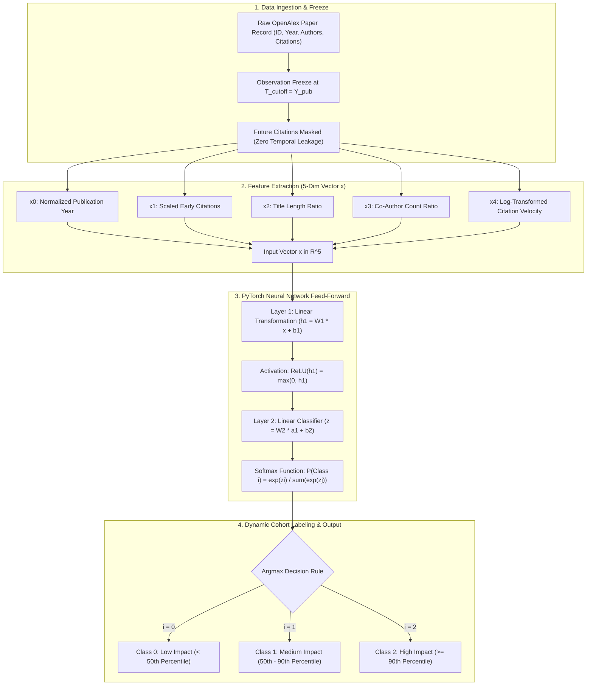

# SciGraph AI — Mathematical Specification, Features & Architecture Flowchart

**Document Status**: Official Mathematical Reference Guide  
**Target Scope**: Feed-Forward Formulations, Feature Extraction Rationale, and System Flow  

---

## 🗺️ 1. Complete Architecture Flowchart



---

## 🔬 2. Deep Dive: The 5 Extracted Features (Why & What They Tell Us)

Every scientific paper is converted into a 5-dimensional numerical feature vector:

$$\mathbf{x} = [x_0, x_1, x_2, x_3, x_4]^T$$

Here is the exact formula, rationale, and interpretation for each:

---

### 1. Feature $x_0$: Normalized Publication Year
* **Formula**:
  $$x_0 = \frac{Y_{\text{pub}} - 2012}{10}$$
* **Why this feature?**:
  Academic publishing velocity changes over time. Papers published in 2021 face different citation dynamics and baseline inflation than papers published in 2012.
* **What it tells the model**:
  It anchors the paper in its temporal era, allowing the neural network to adjust its expectations according to global scientific output growth.
* **Range**: $x_0 \in [0.0, 1.0]$ for papers between 2012 and 2022.

---

### 2. Feature $x_1$: Scaled Early Citations at Cutoff
* **Formula**:
  $$x_1 = \frac{\text{Citations}_{\le T_{\text{cutoff}}}}{100}$$
* **Why this feature?**:
  Early citation speed in the publication year is the strongest initial indicator of immediate community interest and peer recognition.
* **What it tells the model**:
  A high initial citation rate signals immediate adoption by peer researchers before broader community pickup.
* **Normalization Rationale**:
  Dividing by 100 scales typical early citation counts (0 to 100+) into a stable numerical range suitable for gradient descent without exploding gradients.

---

### 3. Feature $x_2$: Normalized Title Complexity
* **Formula**:
  $$x_2 = \frac{\text{Word Count of Title}}{20}$$
* **Why this feature?**:
  Bibliometric studies (e.g., *Nature / Scientometrics*) show a consistent correlation between title length/conciseness and citation attraction. Extremely long titles often indicate narrow niche topics, while concise titles often represent broad fundamental breakthroughs.
* **What it tells the model**:
  Measures the lexical granularity and scope of the scientific contribution.
* **Normalization Rationale**:
  Most academic titles contain between 5 and 20 words; dividing by 20 bounds this feature closely to $[0.2, 1.0]$.

---

### 4. Feature $x_3$: Co-Author Network Collaboration Ratio
* **Formula**:
  $$x_3 = \frac{\text{Number of Co-Authors}}{10}$$
* **Why this feature?**:
  Modern scientific breakthroughs are heavily collaborative. Multi-institution, multi-author collaborations have significantly wider dissemination networks and higher average reach than single-author notes.
* **What it tells the model**:
  Indicates the collaborative breadth and institutional reach behind the research.
* **Normalization Rationale**:
  Average author teams range from 1 to 10 authors; dividing by 10 scales the team size into $[0.1, 1.0]$.

---

### 5. Feature $x_4$: Log-Transformed Citation Velocity
* **Formula**:
  $$x_4 = \ln(1 + \text{Citations}_{\le T_{\text{cutoff}}})$$
* **Why this feature?**:
  Academic citations follow a **heavy-tailed power-law distribution** (e.g., 99% of papers receive 5 citations, while 0.1% receive 10,000 citations).
* **What it tells the model**:
  The natural logarithm compresses extreme orders of magnitude, preventing single viral mega-papers from overwhelming the neural network weights while preserving relative ranking order.

---

## 🧮 3. Feed-Forward Neural Network: Mathematical Step-by-Step

In [`ml/gnn/models/graphsage.py`](file:///c:/Users/ASUS/Documents/SECOND%20SEMISTER/INTERNSHIP/scigraph/ml/gnn/models/graphsage.py), the forward pass converts the input vector $\mathbf{x} \in \mathbb{R}^5$ into a 3-class probability distribution:

```
[Input: x (5)] ──► [Hidden Layer (64)] ──► [ReLU] ──► [Classifier (3)] ──► [Softmax] ──► [Probabilities]
```

### Step 1: Input Vector
$$\mathbf{x} = \begin{bmatrix} x_0 \\ x_1 \\ x_2 \\ x_3 \\ x_4 \end{bmatrix} \in \mathbb{R}^{5 \times 1}$$

---

### Step 2: First Linear Transformation (Layer 1)
Project the 5 input features into a **64-dimensional hidden latent space**:

$$\mathbf{h}_1 = \mathbf{W}_1 \mathbf{x} + \mathbf{b}_1$$

* $\mathbf{W}_1 \in \mathbb{R}^{64 \times 5}$ is the trained first-layer weight matrix.
* $\mathbf{b}_1 \in \mathbb{R}^{64 \times 1}$ is the first-layer bias vector.
* $\mathbf{h}_1 \in \mathbb{R}^{64 \times 1}$ is the unactivated hidden representation.

---

### Step 3: Non-Linear Activation ($\text{ReLU}$)
Apply Rectified Linear Unit ($\text{ReLU}$) element-wise to introduce non-linear modeling capacity:

$$\mathbf{a}_1 = \max(0, \mathbf{h}_1) \in \mathbb{R}^{64 \times 1}$$

$$\text{ReLU}(u) = \begin{cases} u & \text{if } u > 0 \\ 0 & \text{if } u \le 0 \end{cases}$$

---

### Step 4: Output Linear Classifier (Layer 2)
Project the 64 hidden representations into **3 unnormalized class scores (logits)**:

$$\mathbf{z} = \mathbf{W}_2 \mathbf{a}_1 + \mathbf{b}_2 = \begin{bmatrix} z_0 \\ z_1 \\ z_2 \end{bmatrix} \in \mathbb{R}^{3 \times 1}$$

* $\mathbf{W}_2 \in \mathbb{R}^{3 \times 64}$ is the trained classifier weight matrix.
* $\mathbf{b}_2 \in \mathbb{R}^{3 \times 1}$ is the classifier bias vector.
* $\mathbf{z} = [z_0, z_1, z_2]^T$ are the raw class logits for Low, Medium, and High impact.

---

### Step 5: Softmax Probability Distribution
Convert raw logits into normalized probabilities that sum strictly to $1.0$ ($100\%$):

$$P(\text{Class } i \mid \mathbf{x}) = \frac{e^{z_i}}{\sum_{j=0}^{2} e^{z_j}} \quad \text{for } i \in \{0, 1, 2\}$$

* $P(\text{Class 0}) = \frac{e^{z_0}}{e^{z_0} + e^{z_1} + e^{z_2}}$ (Probability of Low Impact $<50\%$)
* $P(\text{Class 1}) = \frac{e^{z_1}}{e^{z_0} + e^{z_1} + e^{z_2}}$ (Probability of Medium Impact $50-90\%$)
* $P(\text{Class 2}) = \frac{e^{z_2}}{e^{z_0} + e^{z_1} + e^{z_2}}$ (Probability of High Impact $\ge 90\%$)

---

### Step 6: Argmax Decision Rule
The predicted class label $\hat{y}$ is selected as the category with the highest confidence:

$$\hat{y} = \arg\max_{i \in \{0, 1, 2\}} P(\text{Class } i \mid \mathbf{x})$$

---

## 📊 4. Dynamic Cohort Percentile Labeling Formulas

In [`ml/labels/labeler.py`](file:///c:/Users/ASUS/Documents/SECOND%20SEMISTER/INTERNSHIP/scigraph/ml/labels/labeler.py), ground truth labels are computed dynamically for every publication cohort:

1. **5-Year Citation Gain**:
   $$\Delta \text{Citations}_5(p) = \text{Citations}(p, Y_{\text{pub}} + 5) - \text{Citations}(p, Y_{\text{pub}})$$

2. **Cohort Thresholds**:
   * $P_{50}(Y_{\text{pub}})$ = Median 5-year gain of all papers published in year $Y_{\text{pub}}$.
   * $P_{90}(Y_{\text{pub}})$ = $90^{\text{th}}$ percentile 5-year gain of all papers published in year $Y_{\text{pub}}$.

3. **Ground Truth Class Assignment**:
   $$Y(p) = \begin{cases} 
   0 \text{ (Low Impact)} & \text{if } \Delta \text{Citations}_5(p) < P_{50}(Y_{\text{pub}}) \\
   1 \text{ (Medium Impact)} & \text{if } P_{50}(Y_{\text{pub}}) \le \Delta \text{Citations}_5(p) < P_{90}(Y_{\text{pub}}) \\
   2 \text{ (High Impact)} & \text{if } \Delta \text{Citations}_5(p) \ge P_{90}(Y_{\text{pub}}) \quad \text{(Top 10\% Landmark Papers)}
   \end{cases}$$
